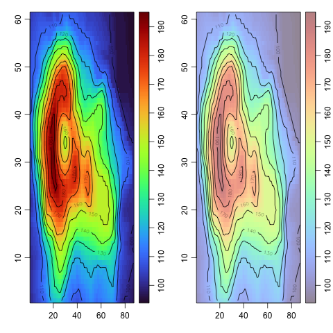

Sometimes I want to put contours on top of an image, because then I have the best of two worlds: colours to give me a feel for the highs and lows of a field, and contours to give me quantitative values.  But there's a problem with this: many colour schemes have some colours that are dark enough to make it difficult to see the contours (and especially the labels) that are placed on top.  So I wrote some R code. Here, it is illustrated with the `volcano` dataset.


```R
# faded_palette.R
# How to fade a colour palette
library(oce)
faded <- function(alpha = 0.1, col = oce::oceColorsTurbo) {
    stopifnot(alpha <= 1 && alpha >= 0)
    function(n) paste0(col(n), as.raw(as.integer(255 * alpha)))
}
par(mfrow = c(1, 2))
# normal
imagep(volcano, col = oceColorsTurbo)
contour(seq_len(dim(volcano)[1]), seq_len(dim(volcano)[2]), volcano, add = TRUE)
# faded
imagep(volcano, col = faded(0.5))
contour(seq_len(dim(volcano)[1]), seq_len(dim(volcano)[2]), volcano, add = TRUE)
```



